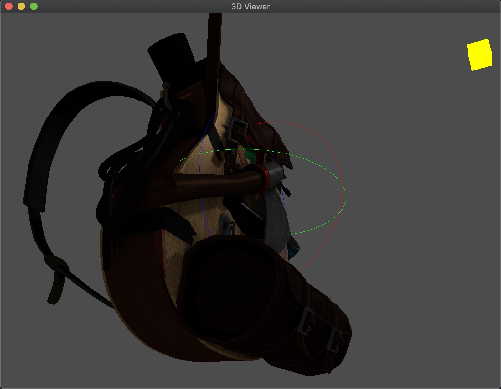

Learn OpenGL. Followed https://learnopengl.com.

In `src/3d_viewer/`, implemented a 3D model viewer as illustrated by:

Todo:

1. Use mouse drag to rotate camera.
2. Point picker.
3. HDR.
4. Multiple light sources.
5. Light source moving with camera.
6. Bloom.
7. Defered rendering.
8. PBR.