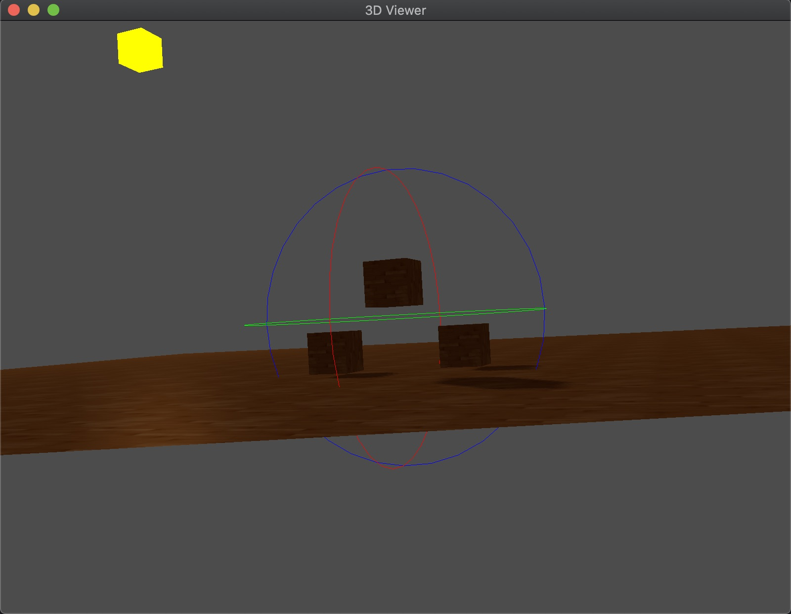

Learn OpenGL. Followed https://learnopengl.com.

In `src/3d_viewer/`, implemented a 3D model viewer as illustrated by:

Todo:

1. Use mouse drag to rotate camera.
2. Point picker.
3. Render wireframe and point cloud.
4. HDR.
5. Multiple light sources.
6. Light source moving with camera.
7. Bloom.
8. Defered rendering.
9. PBR.